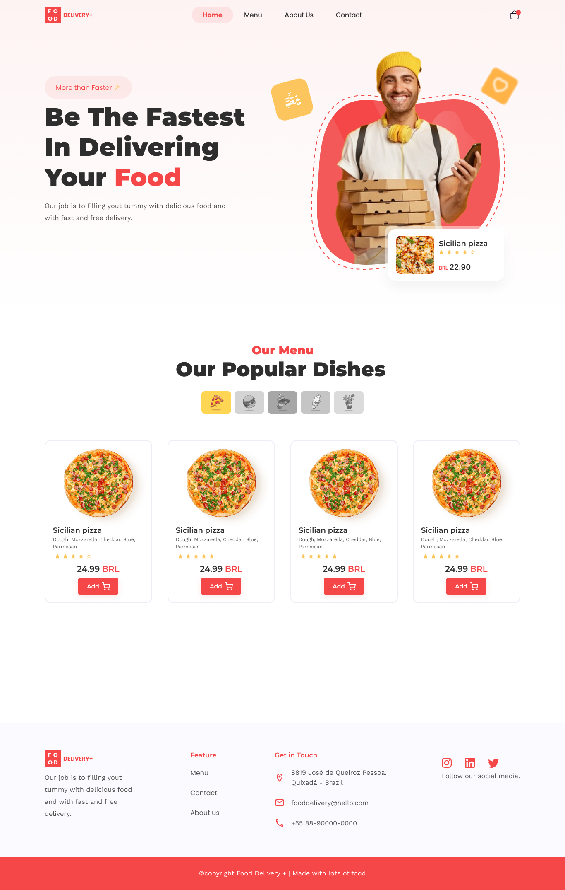

<div align="center">
  
</div>

<div align="center">
  
</div>

## Maybe you ask yourself: why Redux?
The objective of this project was to know and configure a simple project with redux toolkit (or RTK), as this project would combine very well with just Context API or React-Query.

## UI
For this project I created a Figma with all the pages, tokens and components, access it by [clicking here](https://www.figma.com/file/9LQOboZAKbBKwTYK9zbDtM/Food-Delivery%2B?node-id=7%3A136)

## Technologies
- React.js
- @reduxjs/toolkit
- react-router-dom
- styled-components
- polished
- axios
- eslint
- prettier
- Typescript
- husky
- vite
- Miragejs (backend faker)
- Vercel

## install dependencies
```bash
yarn

# or npm i
```

## Run in development
```bash
yarn dev

# or npm run dev
```

## Build
```bash
yarn build

# or npm run build
```
